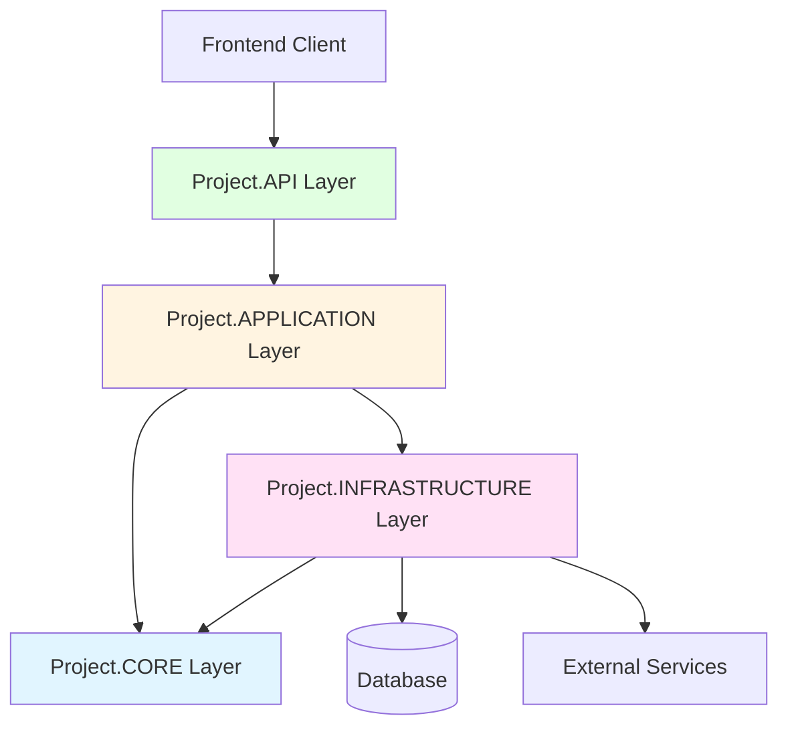
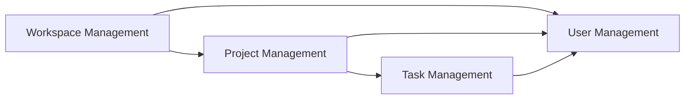
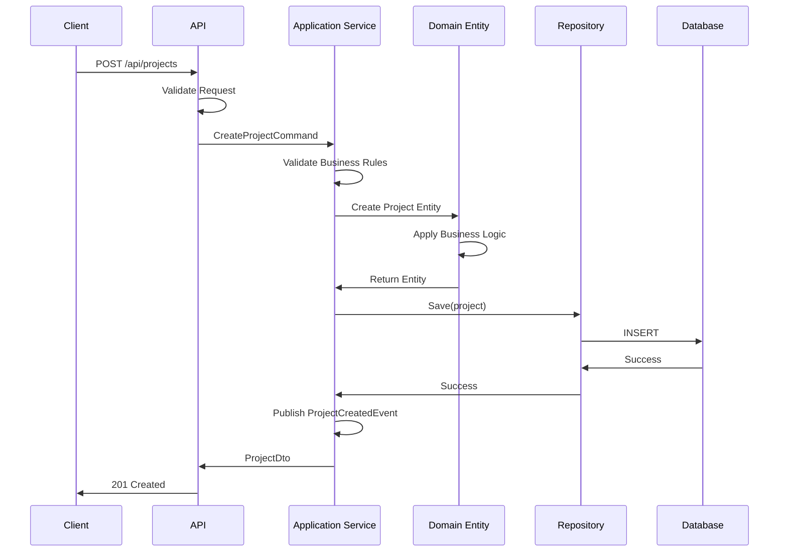
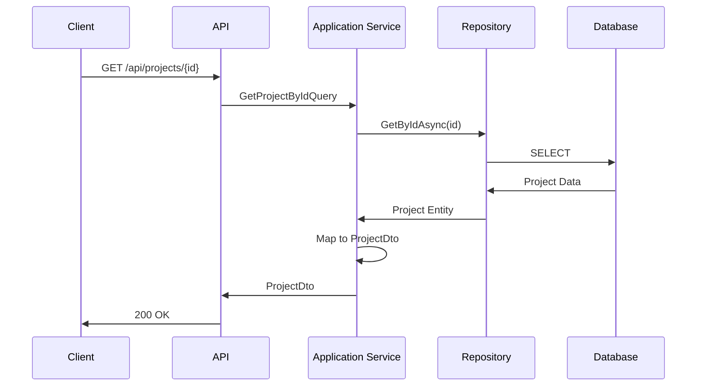
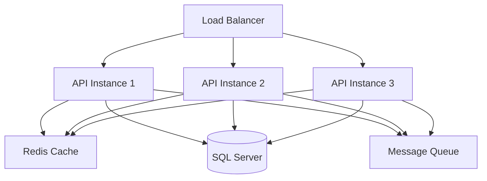

# Backend Architecture - ASP.NET Core with DDD

## Overview

This document outlines the proposed backend architecture for the Project Management application using **C# ASP.NET Core** with **Domain-Driven Design (DDD)** principles and a **layered architecture** pattern.

## Architecture Pattern

The backend follows a **4-layer architecture** with clear separation of concerns:



## Solution Structure

```
ProjectManagement.sln
├── src/
│   ├── Project.API/              # Presentation Layer
│   ├── Project.APPLICATION/      # Application Layer
│   ├── Project.CORE/             # Domain Layer
│   └── Project.INFRASTRUCTURE/   # Infrastructure Layer
└── tests/
    ├── Project.UnitTests/
    ├── Project.IntegrationTests/
    └── Project.FunctionalTests/
```

---

## Layer Responsibilities

### 1. Project.CORE (Domain Layer)

**Purpose**: Contains the business logic and domain models. This is the heart of the application.

**Responsibilities**:
- Define domain entities and value objects
- Define domain events
- Define repository interfaces (contracts)
- Define domain services
- Business rules and validation
- Aggregates and aggregate roots

**Dependencies**: 
- **None** - This layer has no dependencies on other layers
- Only depends on .NET standard libraries

**Key Concepts**:
- **Entities**: Objects with identity (User, Workspace, Project, Task)
- **Value Objects**: Objects without identity (Address, DateRange, Priority)
- **Aggregates**: Cluster of entities treated as a single unit
- **Domain Events**: Events that represent something that happened in the domain
- **Repository Interfaces**: Contracts for data access (implemented in Infrastructure)

**Structure**:
```
Project.CORE/
├── Entities/
│   ├── User.cs
│   ├── Workspace.cs
│   ├── WorkspaceMember.cs
│   ├── Project.cs
│   ├── ProjectMember.cs
│   ├── Task.cs
│   └── Comment.cs
├── ValueObjects/
│   ├── Email.cs
│   ├── Priority.cs
│   ├── ProjectStatus.cs
│   ├── TaskStatus.cs
│   └── TaskType.cs
├── Aggregates/
│   ├── WorkspaceAggregate.cs
│   └── ProjectAggregate.cs
├── Interfaces/
│   ├── IRepository.cs
│   ├── IWorkspaceRepository.cs
│   ├── IProjectRepository.cs
│   ├── ITaskRepository.cs
│   └── IUserRepository.cs
├── DomainEvents/
│   ├── TaskAssignedEvent.cs
│   ├── ProjectCreatedEvent.cs
│   └── WorkspaceMemberAddedEvent.cs
├── DomainServices/
│   └── TaskAssignmentService.cs
├── Exceptions/
│   ├── DomainException.cs
│   ├── EntityNotFoundException.cs
│   └── BusinessRuleViolationException.cs
└── Specifications/
    └── TaskSpecifications.cs
```

---

### 2. Project.APPLICATION (Application Layer)

**Purpose**: Orchestrates the application flow and use cases. Coordinates domain objects to perform tasks.

**Responsibilities**:
- Define application services (use cases)
- Define DTOs (Data Transfer Objects)
- Define command and query handlers (CQRS pattern)
- Application-level validation
- Transaction management
- Authorization logic

**Dependencies**:
- **Project.CORE** - Uses domain entities and repository interfaces

**Key Concepts**:
- **Application Services**: Coordinate domain objects to fulfill use cases
- **DTOs**: Data structures for transferring data between layers
- **Commands**: Represent write operations (CreateProjectCommand)
- **Queries**: Represent read operations (GetProjectByIdQuery)
- **Handlers**: Process commands and queries
- **Validators**: Validate input data using FluentValidation

**Structure**:
```
Project.APPLICATION/
├── Services/
│   ├── WorkspaceService.cs
│   ├── ProjectService.cs
│   ├── TaskService.cs
│   └── UserService.cs
├── DTOs/
│   ├── Workspace/
│   │   ├── WorkspaceDto.cs
│   │   ├── CreateWorkspaceDto.cs
│   │   └── UpdateWorkspaceDto.cs
│   ├── Project/
│   │   ├── ProjectDto.cs
│   │   ├── CreateProjectDto.cs
│   │   └── UpdateProjectDto.cs
│   └── Task/
│       ├── TaskDto.cs
│       ├── CreateTaskDto.cs
│       └── UpdateTaskDto.cs
├── Commands/
│   ├── Workspace/
│   │   ├── CreateWorkspaceCommand.cs
│   │   └── CreateWorkspaceCommandHandler.cs
│   ├── Project/
│   │   ├── CreateProjectCommand.cs
│   │   ├── CreateProjectCommandHandler.cs
│   │   ├── UpdateProjectCommand.cs
│   │   └── UpdateProjectCommandHandler.cs
│   └── Task/
│       ├── CreateTaskCommand.cs
│       ├── CreateTaskCommandHandler.cs
│       ├── UpdateTaskCommand.cs
│       └── UpdateTaskCommandHandler.cs
├── Queries/
│   ├── Workspace/
│   │   ├── GetWorkspaceByIdQuery.cs
│   │   ├── GetWorkspaceByIdQueryHandler.cs
│   │   ├── GetUserWorkspacesQuery.cs
│   │   └── GetUserWorkspacesQueryHandler.cs
│   ├── Project/
│   │   ├── GetProjectByIdQuery.cs
│   │   ├── GetProjectByIdQueryHandler.cs
│   │   ├── GetWorkspaceProjectsQuery.cs
│   │   └── GetWorkspaceProjectsQueryHandler.cs
│   └── Task/
│       ├── GetTaskByIdQuery.cs
│       ├── GetTaskByIdQueryHandler.cs
│       ├── GetProjectTasksQuery.cs
│       └── GetProjectTasksQueryHandler.cs
├── Validators/
│   ├── CreateWorkspaceValidator.cs
│   ├── CreateProjectValidator.cs
│   └── CreateTaskValidator.cs
├── Mappings/
│   └── MappingProfile.cs (AutoMapper)
├── Interfaces/
│   ├── IWorkspaceService.cs
│   ├── IProjectService.cs
│   └── ITaskService.cs
└── Exceptions/
    ├── ApplicationException.cs
    └── ValidationException.cs
```

---

### 3. Project.INFRASTRUCTURE (Infrastructure Layer)

**Purpose**: Implements technical capabilities like data access, external services, and cross-cutting concerns.

**Responsibilities**:
- Implement repository interfaces from CORE
- Database context (Entity Framework Core)
- Entity configurations (Fluent API)
- External service integrations
- Caching
- Logging
- Email services
- File storage

**Dependencies**:
- **Project.CORE** - Implements repository interfaces
- **Entity Framework Core** - ORM
- **External libraries** - Email, storage, etc.

**Structure**:
```
Project.INFRASTRUCTURE/
├── Data/
│   ├── ApplicationDbContext.cs
│   ├── Configurations/
│   │   ├── UserConfiguration.cs
│   │   ├── WorkspaceConfiguration.cs
│   │   ├── ProjectConfiguration.cs
│   │   └── TaskConfiguration.cs
│   └── Migrations/
│       └── (EF Core migrations)
├── Repositories/
│   ├── Repository.cs (Generic)
│   ├── WorkspaceRepository.cs
│   ├── ProjectRepository.cs
│   ├── TaskRepository.cs
│   └── UserRepository.cs
├── Services/
│   ├── EmailService.cs
│   ├── FileStorageService.cs
│   └── CacheService.cs
├── Identity/
│   ├── ApplicationUser.cs
│   └── IdentityConfiguration.cs
└── DependencyInjection.cs
```

---

### 4. Project.API (Presentation Layer)

**Purpose**: Exposes the application functionality via RESTful APIs.

**Responsibilities**:
- Define API endpoints (controllers)
- Request/response models
- Authentication & authorization
- API versioning
- Swagger documentation
- Exception handling middleware
- CORS configuration
- Rate limiting

**Dependencies**:
- **Project.APPLICATION** - Calls application services
- **Project.INFRASTRUCTURE** - For dependency injection setup

**Structure**:
```
Project.API/
├── Controllers/
│   ├── WorkspacesController.cs
│   ├── ProjectsController.cs
│   ├── TasksController.cs
│   ├── UsersController.cs
│   └── AuthController.cs
├── Middleware/
│   ├── ExceptionHandlingMiddleware.cs
│   ├── LoggingMiddleware.cs
│   └── AuthenticationMiddleware.cs
├── Filters/
│   ├── ValidationFilter.cs
│   └── AuthorizationFilter.cs
├── Models/
│   ├── Requests/
│   │   ├── CreateWorkspaceRequest.cs
│   │   ├── CreateProjectRequest.cs
│   │   └── CreateTaskRequest.cs
│   └── Responses/
│       ├── WorkspaceResponse.cs
│       ├── ProjectResponse.cs
│       ├── TaskResponse.cs
│       └── ApiResponse.cs
├── Extensions/
│   └── ServiceCollectionExtensions.cs
├── appsettings.json
├── appsettings.Development.json
├── Program.cs
└── Startup.cs (if using .NET 6/7 style)
```

---

## Domain-Driven Design Concepts

### Aggregates

**Workspace Aggregate**:
- **Root**: Workspace
- **Entities**: WorkspaceMember
- **Invariants**: 
  - Workspace must have an owner
  - Owner must be a member with ADMIN role
  - Workspace slug must be unique

**Project Aggregate**:
- **Root**: Project
- **Entities**: ProjectMember, Task, Comment
- **Invariants**:
  - Project must belong to a workspace
  - Project must have a team lead
  - Team lead must be a project member
  - Task assignee must be a project member
  - End date must be after start date

### Bounded Contexts



**Contexts**:
1. **Workspace Management**: Workspaces, members, roles
2. **Project Management**: Projects, project members, analytics
3. **Task Management**: Tasks, comments, assignments
4. **User Management**: Users, authentication, profiles

### Domain Events

Domain events enable loose coupling and eventual consistency:

- `WorkspaceCreatedEvent`
- `WorkspaceMemberAddedEvent`
- `WorkspaceMemberRemovedEvent`
- `ProjectCreatedEvent`
- `ProjectStatusChangedEvent`
- `TaskCreatedEvent`
- `TaskAssignedEvent`
- `TaskStatusChangedEvent`
- `CommentAddedEvent`

**Event Handlers** (in APPLICATION layer):
- Send email notifications
- Update analytics
- Create activity logs
- Trigger webhooks

---

## Data Flow

### Command Flow (Write Operations)



### Query Flow (Read Operations)



---

## Key Design Patterns

### 1. Repository Pattern
Abstracts data access logic. Repositories are defined in CORE and implemented in INFRASTRUCTURE.

### 2. Unit of Work Pattern
Manages transactions across multiple repositories.

### 3. CQRS (Command Query Responsibility Segregation)
Separates read and write operations for better scalability and maintainability.

### 4. Mediator Pattern
Uses MediatR library to decouple request handling from controllers.

### 5. Specification Pattern
Encapsulates query logic for reusability.

### 6. Factory Pattern
Creates complex domain objects.

---

## Technology Stack

### Core Framework
- **.NET 8.0** (LTS)
- **ASP.NET Core 8.0**
- **C# 12**

### ORM & Database
- **Entity Framework Core 8.0**
- **SQL Server** (or PostgreSQL)
- **Migrations** for schema management

### Libraries & Packages

**Application Layer**:
- **MediatR** - CQRS implementation
- **FluentValidation** - Input validation
- **AutoMapper** - Object mapping

**Infrastructure Layer**:
- **Microsoft.EntityFrameworkCore.SqlServer**
- **Microsoft.AspNetCore.Identity.EntityFrameworkCore** - Authentication
- **Serilog** - Structured logging
- **StackExchange.Redis** - Caching (optional)

**API Layer**:
- **Swashbuckle.AspNetCore** - Swagger/OpenAPI
- **Microsoft.AspNetCore.Authentication.JwtBearer** - JWT authentication
- **AspNetCoreRateLimit** - Rate limiting

**Testing**:
- **xUnit** - Unit testing framework
- **Moq** - Mocking framework
- **FluentAssertions** - Assertion library
- **Microsoft.EntityFrameworkCore.InMemory** - In-memory database for testing

---

## Authentication & Authorization

### Authentication
- **JWT (JSON Web Tokens)** for stateless authentication
- **ASP.NET Core Identity** for user management
- **Refresh tokens** for extended sessions

### Authorization
- **Role-based**: ADMIN, MEMBER
- **Policy-based**: Custom policies for workspace/project access
- **Resource-based**: Check if user has access to specific workspace/project

**Authorization Policies**:
- `WorkspaceAdmin`: User must be workspace admin
- `WorkspaceMember`: User must be workspace member
- `ProjectMember`: User must be project member

---

## API Design Principles

### RESTful Conventions
- **GET**: Retrieve resources
- **POST**: Create resources
- **PUT**: Update entire resource
- **PATCH**: Partial update
- **DELETE**: Remove resource

### Versioning
- URL versioning: `/api/v1/projects`
- Header versioning (alternative): `api-version: 1.0`

### Response Format
```json
{
  "success": true,
  "data": {...},
  "message": "Operation successful",
  "errors": []
}
```

### Error Handling
```json
{
  "success": false,
  "data": null,
  "message": "Validation failed",
  "errors": [
    {
      "field": "name",
      "message": "Name is required"
    }
  ]
}
```

### Status Codes
- **200 OK**: Successful GET, PUT, PATCH
- **201 Created**: Successful POST
- **204 No Content**: Successful DELETE
- **400 Bad Request**: Validation error
- **401 Unauthorized**: Authentication required
- **403 Forbidden**: Insufficient permissions
- **404 Not Found**: Resource not found
- **500 Internal Server Error**: Server error

---

## Database Strategy

### Entity Framework Core Configuration
- **Code-First** approach with migrations
- **Fluent API** for entity configuration (not data annotations)
- **Shadow properties** for audit fields (CreatedAt, UpdatedAt)
- **Global query filters** for soft delete

### Performance Optimizations
- **Eager loading** with `.Include()` for related data
- **Lazy loading** disabled by default
- **AsNoTracking()** for read-only queries
- **Compiled queries** for frequently used queries
- **Indexes** on foreign keys and frequently queried fields

### Migrations
- Automated migrations in development
- Scripted migrations for production
- Seed data for initial setup

---

## Cross-Cutting Concerns

### Logging
- **Serilog** with structured logging
- Log levels: Trace, Debug, Information, Warning, Error, Critical
- Log to console (development) and file/database (production)

### Caching
- **In-memory caching** for frequently accessed data
- **Distributed caching** (Redis) for scalability
- Cache invalidation on data changes

### Exception Handling
- Global exception handling middleware
- Custom exception types for different scenarios
- Detailed logging of exceptions

### Validation
- **FluentValidation** for complex validation rules
- **Data annotations** for simple validations
- Validation at both API and Application layers

---

## Scalability Considerations

### Horizontal Scaling
- Stateless API design (JWT tokens)
- Distributed caching (Redis)
- Load balancing

### Vertical Scaling
- Database indexing
- Query optimization
- Connection pooling

### Future Enhancements
- **Message Queue** (RabbitMQ, Azure Service Bus) for async processing
- **CQRS with separate read/write databases**
- **Event Sourcing** for audit trail
- **GraphQL** for flexible querying
- **SignalR** for real-time updates

---

## Security Best Practices

1. **Input Validation**: Validate all inputs
2. **SQL Injection Prevention**: Use parameterized queries (EF Core handles this)
3. **XSS Prevention**: Encode outputs
4. **CSRF Protection**: Use anti-forgery tokens
5. **HTTPS Only**: Enforce HTTPS in production
6. **Secrets Management**: Use Azure Key Vault or similar
7. **Rate Limiting**: Prevent abuse
8. **CORS**: Configure allowed origins

---

## Deployment Architecture



### Deployment Options
- **Azure App Service** - PaaS option
- **Docker + Kubernetes** - Container orchestration
- **Azure Functions** - Serverless for background tasks
- **Azure SQL Database** - Managed database

---

## Testing Strategy

### Unit Tests
- Test domain logic in CORE layer
- Test application services in APPLICATION layer
- Mock repositories and external dependencies

### Integration Tests
- Test repository implementations with in-memory database
- Test API endpoints with TestServer

### Functional Tests
- End-to-end API tests
- Test complete user workflows

### Test Coverage Goals
- **CORE**: 90%+ (critical business logic)
- **APPLICATION**: 80%+
- **INFRASTRUCTURE**: 70%+
- **API**: 70%+

---

## Development Workflow

1. **Define Domain Model** (CORE)
2. **Create Repository Interface** (CORE)
3. **Implement Repository** (INFRASTRUCTURE)
4. **Create Application Service** (APPLICATION)
5. **Create API Endpoint** (API)
6. **Write Tests** (All layers)
7. **Run Migrations**
8. **Test Manually** (Swagger/Postman)

---

## Monitoring & Observability

### Application Insights
- Request tracking
- Dependency tracking
- Exception tracking
- Custom metrics

### Health Checks
- Database connectivity
- External service availability
- Memory usage

### Metrics
- Request rate
- Response time
- Error rate
- Active users

---

This architecture provides a solid foundation for a scalable, maintainable, and testable project management system using modern .NET practices and DDD principles.
