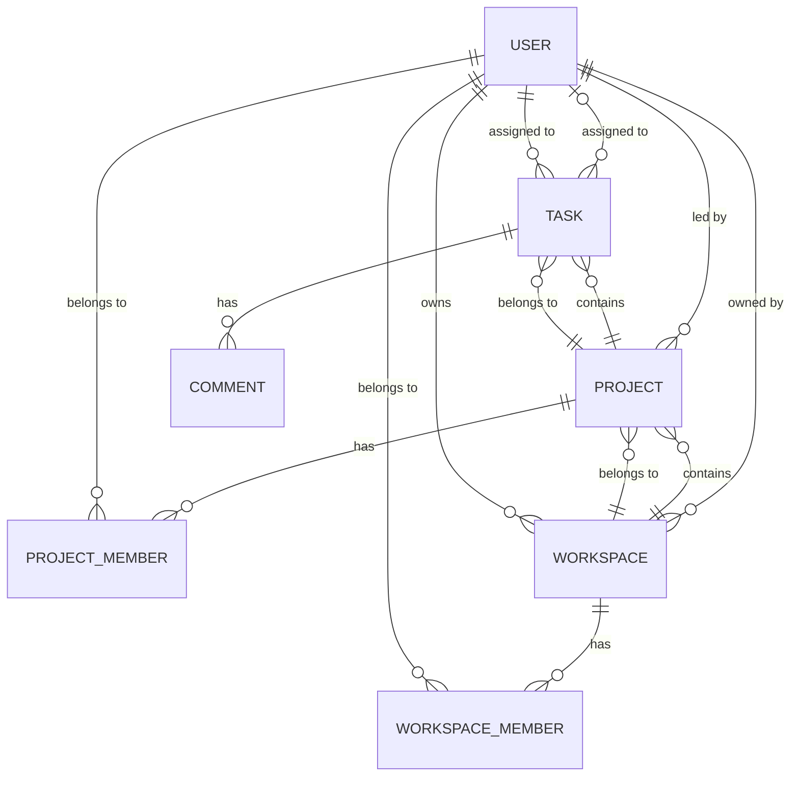

# Data Models

This document describes the data entities used in the project management application based on the dummy data structure.

## Entity Relationship Diagram



## Entities

### 1. User

Represents a user in the system.

**Properties:**
| Field | Type | Description | Example |
|-------|------|-------------|---------|
| `id` | string | Unique identifier | `"user_1"` |
| `name` | string | Full name of the user | `"Alex Smith"` |
| `email` | string | Email address | `"alexsmith@example.com"` |
| `image` | string/URL | Profile image URL | `profile_img_a` |
| `createdAt` | ISO 8601 DateTime | Account creation timestamp | `"2025-10-06T11:04:03.485Z"` |
| `updatedAt` | ISO 8601 DateTime | Last update timestamp | `"2025-10-06T11:04:03.485Z"` |

**Example:**
```json
{
  "id": "user_1",
  "name": "Alex Smith",
  "email": "alexsmith@example.com",
  "image": "profile_img_a.svg",
  "createdAt": "2025-10-06T11:04:03.485Z",
  "updatedAt": "2025-10-06T11:04:03.485Z"
}
```

---

### 2. Workspace

Represents an organization or team workspace that contains projects.

**Properties:**
| Field | Type | Description | Example |
|-------|------|-------------|---------|
| `id` | string | Unique identifier | `"org_1"` |
| `name` | string | Workspace name | `"Corp Workspace"` |
| `slug` | string | URL-friendly identifier | `"corp-workspace"` |
| `description` | string \| null | Workspace description | `null` |
| `settings` | object | Workspace settings (JSON) | `{}` |
| `ownerId` | string | Reference to User | `"user_3"` |
| `image_url` | string/URL | Workspace logo/image | `workspace_img_default` |
| `createdAt` | ISO 8601 DateTime | Creation timestamp | `"2025-10-13T06:55:44.423Z"` |
| `updatedAt` | ISO 8601 DateTime | Last update timestamp | `"2025-10-13T07:17:36.890Z"` |
| `members` | WorkspaceMember[] | Array of workspace members | `[...]` |
| `projects` | Project[] | Array of projects | `[...]` |
| `owner` | User | Owner user object | `{...}` |

**Example:**
```json
{
  "id": "org_1",
  "name": "Corp Workspace",
  "slug": "corp-workspace",
  "description": null,
  "settings": {},
  "ownerId": "user_3",
  "image_url": "workspace_img_default.png",
  "createdAt": "2025-10-13T06:55:44.423Z",
  "updatedAt": "2025-10-13T07:17:36.890Z",
  "members": [...],
  "projects": [...],
  "owner": {...}
}
```

---

### 3. WorkspaceMember

Represents a user's membership in a workspace with their role.

**Properties:**
| Field | Type | Description | Example |
|-------|------|-------------|---------|
| `id` | UUID | Unique identifier | `"a7422a50-7dfb-4e34-989c-881481250f0e"` |
| `userId` | string | Reference to User | `"user_1"` |
| `workspaceId` | string | Reference to Workspace | `"org_1"` |
| `message` | string | Invitation/join message | `""` |
| `role` | enum | User role in workspace | `"ADMIN"` |
| `user` | User | User object | `{...}` |

**Role Enum:**
- `ADMIN`: Full administrative access
- `MEMBER`: Standard member access (inferred from data)

**Example:**
```json
{
  "id": "a7422a50-7dfb-4e34-989c-881481250f0e",
  "userId": "user_1",
  "workspaceId": "org_1",
  "message": "",
  "role": "ADMIN",
  "user": {...}
}
```

---

### 4. Project

Represents a project within a workspace.

**Properties:**
| Field | Type | Description | Example |
|-------|------|-------------|---------|
| `id` | UUID | Unique identifier | `"4d0f6ef3-e798-4d65-a864-00d9f8085c51"` |
| `name` | string | Project name | `"LaunchPad CRM"` |
| `description` | string | Project description | `"A next-gen CRM for startups..."` |
| `priority` | enum | Project priority level | `"HIGH"` |
| `status` | enum | Project status | `"ACTIVE"` |
| `start_date` | ISO 8601 DateTime | Project start date | `"2025-10-10T00:00:00.000Z"` |
| `end_date` | ISO 8601 DateTime | Project end date | `"2026-02-28T00:00:00.000Z"` |
| `team_lead` | string | Reference to User (team lead) | `"user_3"` |
| `workspaceId` | string | Reference to Workspace | `"org_1"` |
| `progress` | number | Completion percentage (0-100) | `65` |
| `createdAt` | ISO 8601 DateTime | Creation timestamp | `"2025-10-13T08:01:35.491Z"` |
| `updatedAt` | ISO 8601 DateTime | Last update timestamp | `"2025-10-13T08:01:45.620Z"` |
| `tasks` | Task[] | Array of tasks | `[...]` |
| `members` | ProjectMember[] | Array of project members | `[...]` |

**Priority Enum:**
- `HIGH`: High priority
- `MEDIUM`: Medium priority
- `LOW`: Low priority

**Status Enum:**
- `ACTIVE`: Currently active
- `PLANNING`: In planning phase
- `COMPLETED`: Finished (inferred)
- `ON_HOLD`: Paused (inferred)

**Example:**
```json
{
  "id": "4d0f6ef3-e798-4d65-a864-00d9f8085c51",
  "name": "LaunchPad CRM",
  "description": "A next-gen CRM for startups to manage customer pipelines, analytics, and automation.",
  "priority": "HIGH",
  "status": "ACTIVE",
  "start_date": "2025-10-10T00:00:00.000Z",
  "end_date": "2026-02-28T00:00:00.000Z",
  "team_lead": "user_3",
  "workspaceId": "org_1",
  "progress": 65,
  "createdAt": "2025-10-13T08:01:35.491Z",
  "updatedAt": "2025-10-13T08:01:45.620Z",
  "tasks": [...],
  "members": [...]
}
```

---

### 5. ProjectMember

Represents a user's membership in a specific project.

**Properties:**
| Field | Type | Description | Example |
|-------|------|-------------|---------|
| `id` | UUID | Unique identifier | `"17dc3764-737f-4584-9b54-d1a3b401527d"` |
| `userId` | string | Reference to User | `"user_1"` |
| `projectId` | UUID | Reference to Project | `"4d0f6ef3-e798-4d65-a864-00d9f8085c51"` |
| `user` | User | User object | `{...}` |

**Example:**
```json
{
  "id": "17dc3764-737f-4584-9b54-d1a3b401527d",
  "userId": "user_1",
  "projectId": "4d0f6ef3-e798-4d65-a864-00d9f8085c51",
  "user": {...}
}
```

---

### 6. Task

Represents a task within a project.

**Properties:**
| Field | Type | Description | Example |
|-------|------|-------------|---------|
| `id` | UUID | Unique identifier | `"24ca6d74-7d32-41db-a257-906a90bca8f4"` |
| `projectId` | UUID | Reference to Project | `"4d0f6ef3-e798-4d65-a864-00d9f8085c51"` |
| `title` | string | Task title | `"Design Dashboard UI"` |
| `description` | string | Task description | `"Create a modern, responsive CRM dashboard layout."` |
| `status` | enum | Task status | `"IN_PROGRESS"` |
| `type` | enum | Task type/category | `"FEATURE"` |
| `priority` | enum | Task priority | `"HIGH"` |
| `assigneeId` | string | Reference to User (assignee) | `"user_1"` |
| `due_date` | ISO 8601 DateTime | Task due date | `"2025-10-31T00:00:00.000Z"` |
| `createdAt` | ISO 8601 DateTime | Creation timestamp | `"2025-10-13T08:04:04.084Z"` |
| `updatedAt` | ISO 8601 DateTime | Last update timestamp | `"2025-10-13T08:04:04.084Z"` |
| `assignee` | User | Assignee user object | `{...}` |
| `comments` | Comment[] | Array of comments | `[]` |

**Status Enum:**
- `TODO`: Not started
- `IN_PROGRESS`: Currently being worked on
- `DONE`: Completed (inferred)
- `BLOCKED`: Blocked by dependencies (inferred)

**Type Enum:**
- `FEATURE`: New feature development
- `BUG`: Bug fix
- `TASK`: General task
- `IMPROVEMENT`: Enhancement/improvement
- `OTHER`: Other types

**Priority Enum:**
- `HIGH`: High priority
- `MEDIUM`: Medium priority
- `LOW`: Low priority

**Example:**
```json
{
  "id": "24ca6d74-7d32-41db-a257-906a90bca8f4",
  "projectId": "4d0f6ef3-e798-4d65-a864-00d9f8085c51",
  "title": "Design Dashboard UI",
  "description": "Create a modern, responsive CRM dashboard layout.",
  "status": "IN_PROGRESS",
  "type": "FEATURE",
  "priority": "HIGH",
  "assigneeId": "user_1",
  "due_date": "2025-10-31T00:00:00.000Z",
  "createdAt": "2025-10-13T08:04:04.084Z",
  "updatedAt": "2025-10-13T08:04:04.084Z",
  "assignee": {...},
  "comments": []
}
```

---

### 7. Comment (Inferred)

Represents a comment on a task. Currently an empty array in dummy data but structure can be inferred.

**Properties (Proposed):**
| Field | Type | Description | Example |
|-------|------|-------------|---------|
| `id` | UUID | Unique identifier | `"comment_1"` |
| `taskId` | UUID | Reference to Task | `"24ca6d74-7d32-41db-a257-906a90bca8f4"` |
| `userId` | string | Reference to User (author) | `"user_1"` |
| `content` | string | Comment text | `"Updated the design mockups"` |
| `createdAt` | ISO 8601 DateTime | Creation timestamp | `"2025-10-15T10:30:00.000Z"` |
| `updatedAt` | ISO 8601 DateTime | Last update timestamp | `"2025-10-15T10:30:00.000Z"` |
| `user` | User | Author user object | `{...}` |

---

## Relationships

### One-to-Many Relationships
- **User → Workspace**: A user can own multiple workspaces
- **Workspace → Project**: A workspace can contain multiple projects
- **Project → Task**: A project can contain multiple tasks
- **Task → Comment**: A task can have multiple comments

### Many-to-Many Relationships
- **User ↔ Workspace**: Through `WorkspaceMember` (users can be members of multiple workspaces)
- **User ↔ Project**: Through `ProjectMember` (users can be members of multiple projects)

### One-to-One Relationships
- **Task → User**: A task is assigned to one user (assignee)
- **Project → User**: A project has one team lead

---

## Data Validation Rules

### User
- `email` must be unique and valid email format
- `name` is required
- `image` can be null (default image used)

### Workspace
- `slug` must be unique and URL-safe
- `name` is required
- `ownerId` must reference an existing user

### Project
- `name` is required
- `workspaceId` must reference an existing workspace
- `team_lead` must reference an existing user
- `progress` must be between 0 and 100
- `end_date` should be after `start_date`

### Task
- `title` is required
- `projectId` must reference an existing project
- `assigneeId` must reference an existing user
- `due_date` should be in the future (for new tasks)

---

## Indexing Recommendations (for Backend)

For optimal query performance, the following indexes are recommended:

- **User**: `email` (unique)
- **Workspace**: `slug` (unique), `ownerId`
- **WorkspaceMember**: `userId`, `workspaceId`, composite(`userId`, `workspaceId`)
- **Project**: `workspaceId`, `team_lead`, `status`
- **ProjectMember**: `userId`, `projectId`, composite(`userId`, `projectId`)
- **Task**: `projectId`, `assigneeId`, `status`, `due_date`
- **Comment**: `taskId`, `userId`, `createdAt`

---

## Future Enhancements

### Additional Fields to Consider
- **User**: `role` (ADMIN, USER), `lastLogin`, `isActive`
- **Workspace**: `maxMembers`, `plan` (FREE, PRO, ENTERPRISE)
- **Project**: `budget`, `actualCost`, `tags[]`
- **Task**: `estimatedHours`, `actualHours`, `tags[]`, `attachments[]`
- **Comment**: `mentions[]`, `attachments[]`

### New Entities
- **Notification**: User notifications for task assignments, mentions, etc.
- **Activity Log**: Audit trail for all actions
- **File/Attachment**: File uploads for tasks and comments
- **Tag**: Reusable tags for projects and tasks
- **Sprint**: Agile sprint management
- **TimeEntry**: Time tracking for tasks
