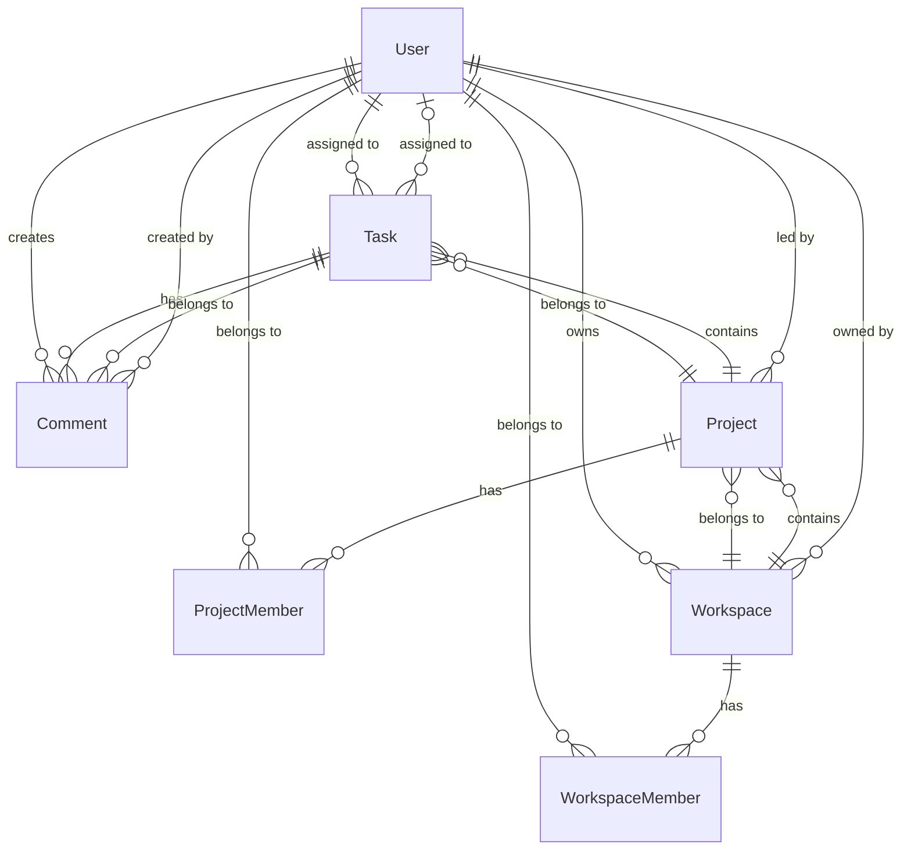

# Database Schema - Entity Framework Core

## Overview

This document describes the database schema for the Project Management application using **Entity Framework Core** with a **Code-First** approach.

## Database Provider

- **Primary**: SQL Server
- **Alternative**: PostgreSQL (with minimal configuration changes)

## Connection String

```json
{
  "ConnectionStrings": {
    "DefaultConnection": "Server=(localdb)\\mssqllocaldb;Database=ProjectManagementDb;Trusted_Connection=True;MultipleActiveResultSets=true"
  }
}
```

---

## Entity Relationship Diagram



---

## Entity Definitions

### 1. User Entity

```csharp
public class User
{
    public string Id { get; set; } // Primary Key
    public string Name { get; set; }
    public string Email { get; set; } // Unique
    public string ImageUrl { get; set; }
    public DateTime CreatedAt { get; set; }
    public DateTime UpdatedAt { get; set; }
    
    // Navigation Properties
    public ICollection<Workspace> OwnedWorkspaces { get; set; }
    public ICollection<WorkspaceMember> WorkspaceMemberships { get; set; }
    public ICollection<Project> LedProjects { get; set; }
    public ICollection<ProjectMember> ProjectMemberships { get; set; }
    public ICollection<Task> AssignedTasks { get; set; }
    public ICollection<Comment> Comments { get; set; }
}
```

**Table**: `Users`

**Indexes**:
- `IX_Users_Email` (Unique)

**Constraints**:
- `Email` is required and unique
- `Name` is required

---

### 2. Workspace Entity

```csharp
public class Workspace
{
    public string Id { get; set; } // Primary Key
    public string Name { get; set; }
    public string Slug { get; set; } // Unique
    public string Description { get; set; }
    public string ImageUrl { get; set; }
    public string Settings { get; set; } // JSON string
    public string OwnerId { get; set; } // Foreign Key
    public DateTime CreatedAt { get; set; }
    public DateTime UpdatedAt { get; set; }
    
    // Navigation Properties
    public User Owner { get; set; }
    public ICollection<WorkspaceMember> Members { get; set; }
    public ICollection<Project> Projects { get; set; }
}
```

**Table**: `Workspaces`

**Indexes**:
- `IX_Workspaces_Slug` (Unique)
- `IX_Workspaces_OwnerId`

**Constraints**:
- `Name` is required
- `Slug` is required and unique
- `OwnerId` is required (Foreign Key to Users)

---

### 3. WorkspaceMember Entity

```csharp
public class WorkspaceMember
{
    public string Id { get; set; } // Primary Key (GUID)
    public string UserId { get; set; } // Foreign Key
    public string WorkspaceId { get; set; } // Foreign Key
    public string Message { get; set; }
    public WorkspaceRole Role { get; set; } // Enum
    public DateTime JoinedAt { get; set; }
    
    // Navigation Properties
    public User User { get; set; }
    public Workspace Workspace { get; set; }
}

public enum WorkspaceRole
{
    ADMIN = 1,
    MEMBER = 2
}
```

**Table**: `WorkspaceMembers`

**Indexes**:
- `IX_WorkspaceMembers_UserId`
- `IX_WorkspaceMembers_WorkspaceId`
- `IX_WorkspaceMembers_UserId_WorkspaceId` (Unique composite)

**Constraints**:
- `UserId` is required (Foreign Key to Users)
- `WorkspaceId` is required (Foreign Key to Workspaces)
- Unique constraint on (`UserId`, `WorkspaceId`)

---

### 4. Project Entity

```csharp
public class Project
{
    public string Id { get; set; } // Primary Key (GUID)
    public string Name { get; set; }
    public string Description { get; set; }
    public Priority Priority { get; set; } // Enum
    public ProjectStatus Status { get; set; } // Enum
    public DateTime StartDate { get; set; }
    public DateTime EndDate { get; set; }
    public string TeamLeadId { get; set; } // Foreign Key
    public string WorkspaceId { get; set; } // Foreign Key
    public int Progress { get; set; } // 0-100
    public DateTime CreatedAt { get; set; }
    public DateTime UpdatedAt { get; set; }
    
    // Navigation Properties
    public User TeamLead { get; set; }
    public Workspace Workspace { get; set; }
    public ICollection<ProjectMember> Members { get; set; }
    public ICollection<Task> Tasks { get; set; }
}

public enum ProjectStatus
{
    PLANNING = 1,
    ACTIVE = 2,
    ON_HOLD = 3,
    COMPLETED = 4
}

public enum Priority
{
    LOW = 1,
    MEDIUM = 2,
    HIGH = 3
}
```

**Table**: `Projects`

**Indexes**:
- `IX_Projects_WorkspaceId`
- `IX_Projects_TeamLeadId`
- `IX_Projects_Status`

**Constraints**:
- `Name` is required
- `WorkspaceId` is required (Foreign Key to Workspaces)
- `TeamLeadId` is required (Foreign Key to Users)
- `Progress` must be between 0 and 100
- `EndDate` must be after `StartDate` (application-level validation)

---

### 5. ProjectMember Entity

```csharp
public class ProjectMember
{
    public string Id { get; set; } // Primary Key (GUID)
    public string UserId { get; set; } // Foreign Key
    public string ProjectId { get; set; } // Foreign Key
    public DateTime AddedAt { get; set; }
    
    // Navigation Properties
    public User User { get; set; }
    public Project Project { get; set; }
}
```

**Table**: `ProjectMembers`

**Indexes**:
- `IX_ProjectMembers_UserId`
- `IX_ProjectMembers_ProjectId`
- `IX_ProjectMembers_UserId_ProjectId` (Unique composite)

**Constraints**:
- `UserId` is required (Foreign Key to Users)
- `ProjectId` is required (Foreign Key to Projects)
- Unique constraint on (`UserId`, `ProjectId`)

---

### 6. Task Entity

```csharp
public class Task
{
    public string Id { get; set; } // Primary Key (GUID)
    public string ProjectId { get; set; } // Foreign Key
    public string Title { get; set; }
    public string Description { get; set; }
    public TaskStatus Status { get; set; } // Enum
    public TaskType Type { get; set; } // Enum
    public Priority Priority { get; set; } // Enum
    public string AssigneeId { get; set; } // Foreign Key
    public DateTime DueDate { get; set; }
    public DateTime CreatedAt { get; set; }
    public DateTime UpdatedAt { get; set; }
    
    // Navigation Properties
    public Project Project { get; set; }
    public User Assignee { get; set; }
    public ICollection<Comment> Comments { get; set; }
}

public enum TaskStatus
{
    TODO = 1,
    IN_PROGRESS = 2,
    DONE = 3,
    BLOCKED = 4
}

public enum TaskType
{
    FEATURE = 1,
    BUG = 2,
    TASK = 3,
    IMPROVEMENT = 4,
    OTHER = 5
}
```

**Table**: `Tasks`

**Indexes**:
- `IX_Tasks_ProjectId`
- `IX_Tasks_AssigneeId`
- `IX_Tasks_Status`
- `IX_Tasks_DueDate`

**Constraints**:
- `Title` is required
- `ProjectId` is required (Foreign Key to Projects)
- `AssigneeId` is optional (Foreign Key to Users)

---

### 7. Comment Entity

```csharp
public class Comment
{
    public string Id { get; set; } // Primary Key (GUID)
    public string TaskId { get; set; } // Foreign Key
    public string UserId { get; set; } // Foreign Key
    public string Content { get; set; }
    public DateTime CreatedAt { get; set; }
    public DateTime UpdatedAt { get; set; }
    
    // Navigation Properties
    public Task Task { get; set; }
    public User User { get; set; }
}
```

**Table**: `Comments`

**Indexes**:
- `IX_Comments_TaskId`
- `IX_Comments_UserId`
- `IX_Comments_CreatedAt`

**Constraints**:
- `Content` is required
- `TaskId` is required (Foreign Key to Tasks)
- `UserId` is required (Foreign Key to Users)

---

## Entity Configurations (Fluent API)

### UserConfiguration.cs

```csharp
public class UserConfiguration : IEntityTypeConfiguration<User>
{
    public void Configure(EntityTypeBuilder<User> builder)
    {
        builder.ToTable("Users");
        
        builder.HasKey(u => u.Id);
        
        builder.Property(u => u.Id)
            .HasMaxLength(50)
            .IsRequired();
        
        builder.Property(u => u.Name)
            .HasMaxLength(100)
            .IsRequired();
        
        builder.Property(u => u.Email)
            .HasMaxLength(255)
            .IsRequired();
        
        builder.HasIndex(u => u.Email)
            .IsUnique();
        
        builder.Property(u => u.ImageUrl)
            .HasMaxLength(500);
        
        builder.Property(u => u.CreatedAt)
            .HasDefaultValueSql("GETUTCDATE()");
        
        builder.Property(u => u.UpdatedAt)
            .HasDefaultValueSql("GETUTCDATE()");
        
        // Relationships
        builder.HasMany(u => u.OwnedWorkspaces)
            .WithOne(w => w.Owner)
            .HasForeignKey(w => w.OwnerId)
            .OnDelete(DeleteBehavior.Restrict);
        
        builder.HasMany(u => u.WorkspaceMemberships)
            .WithOne(wm => wm.User)
            .HasForeignKey(wm => wm.UserId)
            .OnDelete(DeleteBehavior.Cascade);
        
        builder.HasMany(u => u.LedProjects)
            .WithOne(p => p.TeamLead)
            .HasForeignKey(p => p.TeamLeadId)
            .OnDelete(DeleteBehavior.Restrict);
        
        builder.HasMany(u => u.ProjectMemberships)
            .WithOne(pm => pm.User)
            .HasForeignKey(pm => pm.UserId)
            .OnDelete(DeleteBehavior.Cascade);
        
        builder.HasMany(u => u.AssignedTasks)
            .WithOne(t => t.Assignee)
            .HasForeignKey(t => t.AssigneeId)
            .OnDelete(DeleteBehavior.SetNull);
        
        builder.HasMany(u => u.Comments)
            .WithOne(c => c.User)
            .HasForeignKey(c => c.UserId)
            .OnDelete(DeleteBehavior.Cascade);
    }
}
```

### WorkspaceConfiguration.cs

```csharp
public class WorkspaceConfiguration : IEntityTypeConfiguration<Workspace>
{
    public void Configure(EntityTypeBuilder<Workspace> builder)
    {
        builder.ToTable("Workspaces");
        
        builder.HasKey(w => w.Id);
        
        builder.Property(w => w.Id)
            .HasMaxLength(50)
            .IsRequired();
        
        builder.Property(w => w.Name)
            .HasMaxLength(200)
            .IsRequired();
        
        builder.Property(w => w.Slug)
            .HasMaxLength(200)
            .IsRequired();
        
        builder.HasIndex(w => w.Slug)
            .IsUnique();
        
        builder.Property(w => w.Description)
            .HasMaxLength(1000);
        
        builder.Property(w => w.ImageUrl)
            .HasMaxLength(500);
        
        builder.Property(w => w.Settings)
            .HasColumnType("nvarchar(max)");
        
        builder.Property(w => w.CreatedAt)
            .HasDefaultValueSql("GETUTCDATE()");
        
        builder.Property(w => w.UpdatedAt)
            .HasDefaultValueSql("GETUTCDATE()");
        
        // Relationships
        builder.HasOne(w => w.Owner)
            .WithMany(u => u.OwnedWorkspaces)
            .HasForeignKey(w => w.OwnerId)
            .OnDelete(DeleteBehavior.Restrict);
        
        builder.HasMany(w => w.Members)
            .WithOne(wm => wm.Workspace)
            .HasForeignKey(wm => wm.WorkspaceId)
            .OnDelete(DeleteBehavior.Cascade);
        
        builder.HasMany(w => w.Projects)
            .WithOne(p => p.Workspace)
            .HasForeignKey(p => p.WorkspaceId)
            .OnDelete(DeleteBehavior.Cascade);
    }
}
```

### ProjectConfiguration.cs

```csharp
public class ProjectConfiguration : IEntityTypeConfiguration<Project>
{
    public void Configure(EntityTypeBuilder<Project> builder)
    {
        builder.ToTable("Projects");
        
        builder.HasKey(p => p.Id);
        
        builder.Property(p => p.Id)
            .HasMaxLength(50)
            .IsRequired();
        
        builder.Property(p => p.Name)
            .HasMaxLength(200)
            .IsRequired();
        
        builder.Property(p => p.Description)
            .HasMaxLength(2000);
        
        builder.Property(p => p.Priority)
            .HasConversion<int>()
            .IsRequired();
        
        builder.Property(p => p.Status)
            .HasConversion<int>()
            .IsRequired();
        
        builder.Property(p => p.Progress)
            .HasDefaultValue(0);
        
        builder.Property(p => p.CreatedAt)
            .HasDefaultValueSql("GETUTCDATE()");
        
        builder.Property(p => p.UpdatedAt)
            .HasDefaultValueSql("GETUTCDATE()");
        
        // Relationships
        builder.HasOne(p => p.Workspace)
            .WithMany(w => w.Projects)
            .HasForeignKey(p => p.WorkspaceId)
            .OnDelete(DeleteBehavior.Cascade);
        
        builder.HasOne(p => p.TeamLead)
            .WithMany(u => u.LedProjects)
            .HasForeignKey(p => p.TeamLeadId)
            .OnDelete(DeleteBehavior.Restrict);
        
        builder.HasMany(p => p.Members)
            .WithOne(pm => pm.Project)
            .HasForeignKey(pm => pm.ProjectId)
            .OnDelete(DeleteBehavior.Cascade);
        
        builder.HasMany(p => p.Tasks)
            .WithOne(t => t.Project)
            .HasForeignKey(t => t.ProjectId)
            .OnDelete(DeleteBehavior.Cascade);
        
        // Indexes
        builder.HasIndex(p => p.WorkspaceId);
        builder.HasIndex(p => p.TeamLeadId);
        builder.HasIndex(p => p.Status);
    }
}
```

### TaskConfiguration.cs

```csharp
public class TaskConfiguration : IEntityTypeConfiguration<Task>
{
    public void Configure(EntityTypeBuilder<Task> builder)
    {
        builder.ToTable("Tasks");
        
        builder.HasKey(t => t.Id);
        
        builder.Property(t => t.Id)
            .HasMaxLength(50)
            .IsRequired();
        
        builder.Property(t => t.Title)
            .HasMaxLength(300)
            .IsRequired();
        
        builder.Property(t => t.Description)
            .HasMaxLength(5000);
        
        builder.Property(t => t.Status)
            .HasConversion<int>()
            .IsRequired();
        
        builder.Property(t => t.Type)
            .HasConversion<int>()
            .IsRequired();
        
        builder.Property(t => t.Priority)
            .HasConversion<int>()
            .IsRequired();
        
        builder.Property(t => t.CreatedAt)
            .HasDefaultValueSql("GETUTCDATE()");
        
        builder.Property(t => t.UpdatedAt)
            .HasDefaultValueSql("GETUTCDATE()");
        
        // Relationships
        builder.HasOne(t => t.Project)
            .WithMany(p => p.Tasks)
            .HasForeignKey(t => t.ProjectId)
            .OnDelete(DeleteBehavior.Cascade);
        
        builder.HasOne(t => t.Assignee)
            .WithMany(u => u.AssignedTasks)
            .HasForeignKey(t => t.AssigneeId)
            .OnDelete(DeleteBehavior.SetNull);
        
        builder.HasMany(t => t.Comments)
            .WithOne(c => c.Task)
            .HasForeignKey(c => c.TaskId)
            .OnDelete(DeleteBehavior.Cascade);
        
        // Indexes
        builder.HasIndex(t => t.ProjectId);
        builder.HasIndex(t => t.AssigneeId);
        builder.HasIndex(t => t.Status);
        builder.HasIndex(t => t.DueDate);
    }
}
```

---

## ApplicationDbContext

```csharp
public class ApplicationDbContext : DbContext
{
    public ApplicationDbContext(DbContextOptions<ApplicationDbContext> options)
        : base(options)
    {
    }
    
    public DbSet<User> Users { get; set; }
    public DbSet<Workspace> Workspaces { get; set; }
    public DbSet<WorkspaceMember> WorkspaceMembers { get; set; }
    public DbSet<Project> Projects { get; set; }
    public DbSet<ProjectMember> ProjectMembers { get; set; }
    public DbSet<Task> Tasks { get; set; }
    public DbSet<Comment> Comments { get; set; }
    
    protected override void OnModelCreating(ModelBuilder modelBuilder)
    {
        base.OnModelCreating(modelBuilder);
        
        // Apply all configurations
        modelBuilder.ApplyConfiguration(new UserConfiguration());
        modelBuilder.ApplyConfiguration(new WorkspaceConfiguration());
        modelBuilder.ApplyConfiguration(new WorkspaceMemberConfiguration());
        modelBuilder.ApplyConfiguration(new ProjectConfiguration());
        modelBuilder.ApplyConfiguration(new ProjectMemberConfiguration());
        modelBuilder.ApplyConfiguration(new TaskConfiguration());
        modelBuilder.ApplyConfiguration(new CommentConfiguration());
        
        // Global query filters (e.g., soft delete)
        // modelBuilder.Entity<User>().HasQueryFilter(u => !u.IsDeleted);
    }
    
    public override Task<int> SaveChangesAsync(CancellationToken cancellationToken = default)
    {
        // Automatically update UpdatedAt timestamp
        var entries = ChangeTracker.Entries()
            .Where(e => e.State == EntityState.Modified);
        
        foreach (var entry in entries)
        {
            if (entry.Entity is User user)
                user.UpdatedAt = DateTime.UtcNow;
            else if (entry.Entity is Workspace workspace)
                workspace.UpdatedAt = DateTime.UtcNow;
            else if (entry.Entity is Project project)
                project.UpdatedAt = DateTime.UtcNow;
            else if (entry.Entity is Task task)
                task.UpdatedAt = DateTime.UtcNow;
            else if (entry.Entity is Comment comment)
                comment.UpdatedAt = DateTime.UtcNow;
        }
        
        return base.SaveChangesAsync(cancellationToken);
    }
}
```

---

## Migrations

### Initial Migration

```bash
# Add initial migration
dotnet ef migrations add InitialCreate --project Project.INFRASTRUCTURE --startup-project Project.API

# Update database
dotnet ef database update --project Project.INFRASTRUCTURE --startup-project Project.API
```

### Seed Data

```csharp
public static class DbInitializer
{
    public static void Seed(ApplicationDbContext context)
    {
        // Seed users
        if (!context.Users.Any())
        {
            var users = new List<User>
            {
                new User
                {
                    Id = "user_1",
                    Name = "Alex Smith",
                    Email = "alex@example.com",
                    ImageUrl = "/images/profile_a.svg",
                    CreatedAt = DateTime.UtcNow,
                    UpdatedAt = DateTime.UtcNow
                },
                // ... more users
            };
            
            context.Users.AddRange(users);
            context.SaveChanges();
        }
        
        // Seed workspaces, projects, tasks, etc.
    }
}
```

---

## Performance Optimizations

### Indexes
All foreign keys and frequently queried fields have indexes.

### Query Optimization
```csharp
// Eager loading
var workspace = await context.Workspaces
    .Include(w => w.Owner)
    .Include(w => w.Members)
        .ThenInclude(m => m.User)
    .Include(w => w.Projects)
        .ThenInclude(p => p.Tasks)
    .FirstOrDefaultAsync(w => w.Id == workspaceId);

// Read-only queries
var projects = await context.Projects
    .AsNoTracking()
    .Where(p => p.WorkspaceId == workspaceId)
    .ToListAsync();
```

### Connection Pooling
Enabled by default in EF Core.

---

## Backup & Recovery

### Automated Backups
- Daily full backups
- Hourly transaction log backups
- 30-day retention policy

### Point-in-Time Recovery
SQL Server supports point-in-time recovery with transaction log backups.

---

## Security

### SQL Injection Prevention
EF Core uses parameterized queries by default.

### Encryption
- **At Rest**: Transparent Data Encryption (TDE) in SQL Server
- **In Transit**: SSL/TLS for database connections

### Access Control
- Least privilege principle for database users
- Separate read/write users for different environments

---

This schema provides a solid foundation for the project management system with proper relationships, constraints, and performance optimizations.
