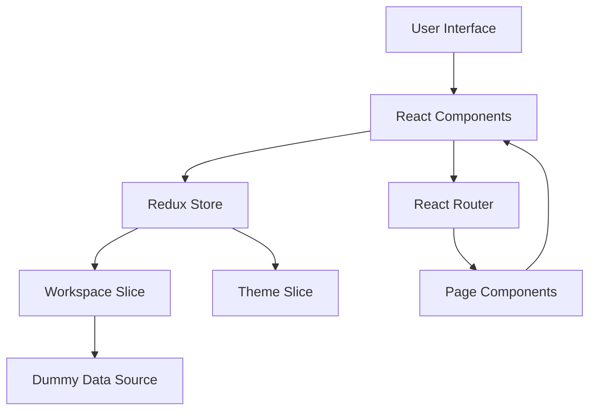
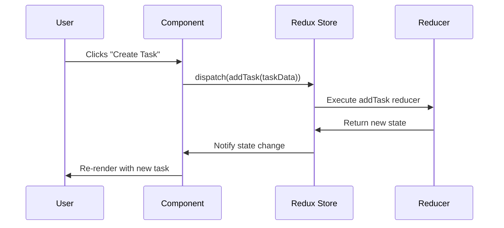

# Frontend Architecture

## Overview

This project management application is built using **React 19** with a modern, component-based architecture. The application follows a feature-based folder structure with clear separation of concerns between UI components, state management, and routing.

## Architecture Pattern

The application implements a **Flux-based architecture** using Redux Toolkit for state management, combined with React Router for client-side routing.



## Project Structure

```
src/
├── app/                    # Redux store configuration
│   └── store.js           # Central store setup
├── assets/                # Static assets and dummy data
│   ├── assets.js         # Dummy data exports
│   └── *.png, *.svg      # Images and icons
├── components/            # Reusable UI components
│   ├── Navbar.jsx
│   ├── Sidebar.jsx
│   ├── WorkspaceDropdown.jsx
│   ├── ProjectCard.jsx
│   ├── CreateProjectDialog.jsx
│   ├── CreateTaskDialog.jsx
│   ├── ProjectTasks.jsx
│   ├── ProjectAnalytics.jsx
│   ├── ProjectCalendar.jsx
│   ├── ProjectOverview.jsx
│   ├── ProjectSettings.jsx
│   ├── StatsGrid.jsx
│   ├── TasksSummary.jsx
│   ├── RecentActivity.jsx
│   ├── MyTasksSidebar.jsx
│   ├── ProjectsSidebar.jsx
│   ├── AddProjectMember.jsx
│   └── InviteMemberDialog.jsx
├── features/              # Redux slices (state management)
│   ├── workspaceSlice.js # Workspace, project, and task state
│   └── themeSlice.js     # Theme state (dark/light mode)
├── pages/                 # Route-level page components
│   ├── Layout.jsx        # Main layout wrapper
│   ├── Dashboard.jsx     # Dashboard overview
│   ├── Projects.jsx      # Projects listing
│   ├── ProjectDetails.jsx # Single project view
│   ├── TaskDetails.jsx   # Single task view
│   └── Team.jsx          # Team management
├── App.jsx               # Root component with routing
├── main.jsx              # Application entry point
└── index.css             # Global styles
```

## Core Architectural Layers

### 1. Presentation Layer (Components & Pages)

**Pages** are route-level components that compose smaller, reusable **components**:

- **Layout.jsx**: Provides the main application shell with sidebar and navbar
- **Dashboard.jsx**: Displays workspace overview, stats, and recent activity
- **Projects.jsx**: Lists all projects in the current workspace
- **ProjectDetails.jsx**: Shows detailed project information with tabs (Overview, Tasks, Analytics, Calendar, Settings)
- **TaskDetails.jsx**: Displays task details with comments and metadata
- **Team.jsx**: Manages workspace members and invitations

### 2. State Management Layer (Redux)

The application uses **Redux Toolkit** for centralized state management:

#### Workspace Slice (`workspaceSlice.js`)

Manages all workspace-related data including:
- List of workspaces
- Current active workspace
- Projects within workspaces
- Tasks within projects
- Members

**Key Actions:**
- `setWorkspaces`: Initialize workspaces
- `setCurrentWorkspace`: Switch active workspace
- `addWorkspace`: Create new workspace
- `updateWorkspace`: Modify workspace details
- `deleteWorkspace`: Remove workspace
- `addProject`: Create project in workspace
- `addTask`: Create task in project
- `updateTask`: Modify task details
- `deleteTask`: Remove task(s)

#### Theme Slice (`themeSlice.js`)

Manages application theme (light/dark mode).

### 3. Data Layer (Assets)

Currently uses **dummy data** defined in `src/assets/assets.js`:
- `dummyUsers`: User profiles
- `dummyWorkspaces`: Workspaces with nested projects, tasks, and members

> **Note**: This layer will be replaced with API calls to the backend once implemented.

### 4. Routing Layer

Uses **React Router v7** for client-side routing:

```javascript
/                    → Dashboard
/team                → Team Management
/projects            → Projects List
/projectsDetail      → Project Details
/taskDetails         → Task Details
```

## Data Flow

### Read Flow
1. Component mounts
2. Component selects data from Redux store using `useSelector`
3. Redux store returns data from appropriate slice
4. Component renders with data

### Write Flow
1. User interacts with UI (e.g., creates a task)
2. Component dispatches Redux action using `useDispatch`
3. Reducer updates state immutably
4. All subscribed components re-render with new state



## Component Communication

### Parent-Child Communication
- **Props**: Data flows down from parent to child
- **Callbacks**: Events flow up from child to parent

### Sibling Communication
- **Redux Store**: Siblings communicate through shared state
- Example: `CreateTaskDialog` adds a task → `ProjectTasks` displays it

## Styling Strategy

- **Tailwind CSS v4**: Utility-first CSS framework
- **Responsive Design**: Mobile-first approach with breakpoint utilities
- **Dark Mode**: Theme toggle managed via Redux
- **Icons**: Lucide React for consistent iconography

## Key Design Patterns

### 1. Container/Presentational Pattern
- **Pages** act as containers (connect to Redux)
- **Components** are presentational (receive props)

### 2. Composition Pattern
- Complex UIs built by composing smaller components
- Example: `ProjectDetails` composes `ProjectOverview`, `ProjectTasks`, `ProjectAnalytics`, etc.

### 3. Controlled Components
- Form inputs controlled via React state
- Single source of truth for form data

### 4. Optimistic UI Updates
- Redux state updated immediately
- UI reflects changes before backend confirmation (when backend is integrated)

## Performance Considerations

### Current Optimizations
- **Code Splitting**: Vite handles automatic code splitting
- **Lazy Loading**: Can be implemented for routes if needed
- **Memoization**: Can use `React.memo` for expensive components

### Future Optimizations (Post-Backend Integration)
- **Data Caching**: Implement RTK Query for automatic caching
- **Pagination**: Load projects/tasks in chunks
- **Virtual Scrolling**: For large lists
- **Debouncing**: For search and filter operations

## State Management Strategy

### Why Redux Toolkit?

1. **Centralized State**: Single source of truth for workspace data
2. **Predictable Updates**: Immutable state updates via reducers
3. **DevTools**: Time-travel debugging and state inspection
4. **Scalability**: Easy to add new slices as features grow

### State Shape

```javascript
{
  workspace: {
    workspaces: [...],        // All workspaces
    currentWorkspace: {...},  // Active workspace with projects & tasks
    loading: false
  },
  theme: {
    mode: 'light' | 'dark'
  }
}
```

## Error Handling

- **React Hot Toast**: User-friendly notifications for success/error states
- **Try-Catch**: Error boundaries can be added for component-level errors

## Future Architecture Enhancements

### When Backend is Integrated

1. **API Layer**: Create `src/api/` directory with service modules
2. **RTK Query**: Replace manual Redux actions with RTK Query endpoints
3. **Authentication**: Add auth slice and protected routes
4. **WebSockets**: Real-time updates for collaborative features
5. **Caching Strategy**: Implement cache invalidation and refetching
6. **Error Boundaries**: Add React error boundaries for graceful failures

### Recommended Structure with Backend

```
src/
├── api/
│   ├── workspaceApi.js
│   ├── projectApi.js
│   ├── taskApi.js
│   └── authApi.js
├── features/
│   ├── auth/
│   ├── workspace/
│   ├── project/
│   └── task/
└── utils/
    ├── apiClient.js
    └── errorHandler.js
```

## Testing Strategy (Recommended)

1. **Unit Tests**: Test individual components and reducers
2. **Integration Tests**: Test component interactions
3. **E2E Tests**: Test complete user flows
4. **Tools**: Vitest, React Testing Library, Playwright

## Accessibility

- Semantic HTML elements
- ARIA labels for interactive elements
- Keyboard navigation support
- Color contrast compliance

## Browser Support

- Modern browsers (Chrome, Firefox, Safari, Edge)
- ES6+ features via Vite transpilation
- No IE11 support required
